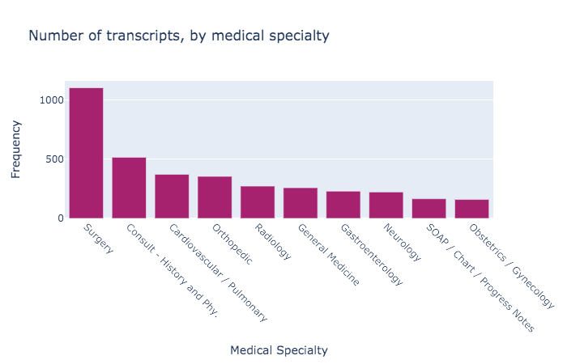
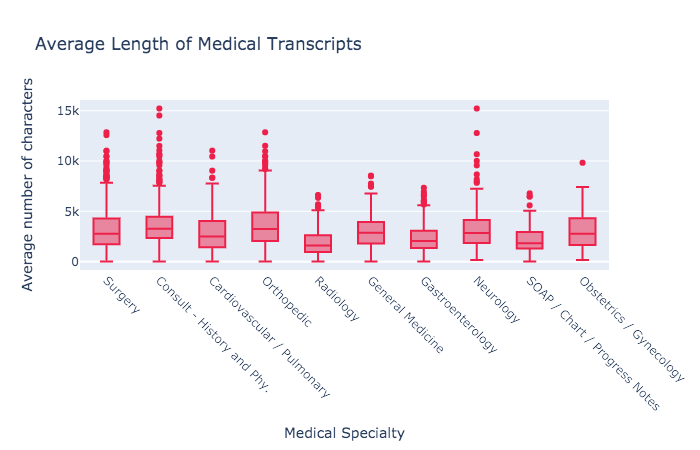
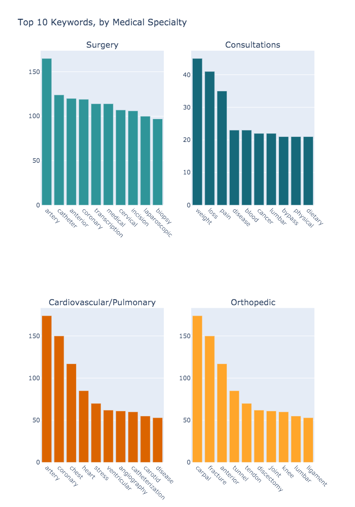
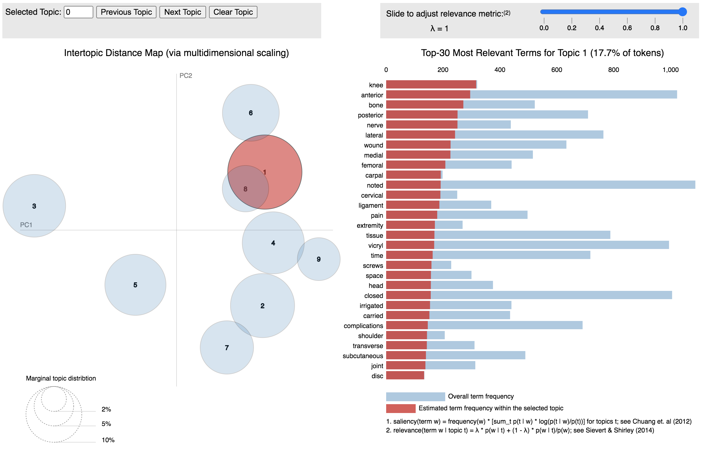

# Topic Modeling with Medical Transcripts Data


## 1a. Project Overview

## 1b. Problem Statement
Quickly summarize thousands of transcripts
Accurately classify new transcripts as they come in


## 1c. Metrics
There are multiple ways to evaluate an LDA topic model, and there are also several metrics to choose from.

Topic Coherence scores a single topic by measuring the degree of semantic similarity between high scoring words in the topic. These measurements help distinguish between topics that are semantically interpretable topics and topics that are artifacts of statistical inference.
```
# Compute Coherence Score
from gensim.models import CoherenceModel
coherence_model_lda = CoherenceModel(model=lda_model, texts=data_lemmatized, dictionary=id2word, coherence='c_v')
coherence_lda = coherence_model_lda.get_coherence()
print('\nCoherence Score: ', coherence_lda)
```
Silhouette score: Silhouette analysis can be used to study the separation distance between the resulting clusters. The silhouette plot displays a measure of how close each point in one cluster is to points in the neighboring clusters and thus provides a way to assess parameters like number of clusters visually. This measure has a range of -1 to 1]. The silhouette analysis is used to choose an optimal value for the number of topic clusters.
```
# Compute silhouette score
from sklearn.metrics import silhouette_samples, silhouette_score
silhouette_avg = silhouette_score(X, cluster_labels)
sample_silhouette_values = silhouette_samples(X, cluster_labels)
```
Classification performance: Label the documents by the topics learned in LDA, and run a multi-class SVM classifier on the data set. The SVM training accuracy is your evaluation. Typically, accuracy or the F1-score would be good metrics of classification performance; the sklearn library includes a good package for this purpose.
```
# Compute multiclass classification metrics report
from sklearn.metrics import classification_report
print(classification_report(y_true, y_pred, target_names=target_names))
```

## 2a. Data Exploration
Storing the data to an S3 bucket
Converting the data to recordio format
```
# convert documents_training to Protobuf RecordIO format
recordio_protobuf_serializer = numpy_to_record_serializer()
fbuffer = recordio_protobuf_serializer(dense_matrix)
```
Missing data
Renaming and cleaning
Splitting data into subsets by specialty


## 2b. Exploratory Visualization
Number of transcripts, by specialty


Length of transcripts, by specialty


Top 10 keywords, by specialty


## 2c. Algorithms and Techniques

*Latent Dirichlet Allocation (LDA)*
Topic modelling refers to the task of identifying topics that best describes a set of documents. These topics will only emerge during the topic modelling process (therefore called latent). And one popular topic modelling technique is known as Latent Dirichlet Allocation (LDA). LDA imagines a fixed set of topics. Each topic represents a set of words. The goal of LDA is to map all the documents to the topics in a such a way that the words in each document are mostly captured by those imaginary topics.

LDA is based on word frequencies and topics distribution in texts. To put it simply, this method counts words in a given data set and groups them based on their co-occurrence into topics. Then the percentage distribution of topics in each document is calculated.

It's common to visualize the LDA topics for interpretability using a popular visualization package, `pyLDAvis` which is designed to help interactively with:

Better understanding and interpreting individual topics, and
Better understanding the relationships between the topics.
Exploring the Intertopic Distance Plot using `pyLDAvis` can help the user learn about how topics relate to each other, including potential higher-level structure between groups of topics.

*Multi-label classification*
Multiclass problems involve classifying something into one of N classes (e.g. “red”, “white” or “blue”, etc).
A classification task with more than two classes; e.g., classify a set of images of fruits which may be oranges, apples, or pears. Multi-class classification makes the assumption that each sample is assigned to one and only one label.
With imbalanced classes, it’s easy to get a high accuracy without actually making useful predictions. So, accuracy as an evaluation metrics makes sense only if the class labels are uniformly distributed. In case of imbalanced classes confusion-matrix is good technique to summarizing the performance of a classification algorithm.
Confusion Matrix is a performance measurement for a classification algorithm where output can be two or more classes.
quantitative metrics (e.g. Precision, Recall, F1, Confusion Matrix)

## 2d. Benchmark


## 3a. Data Processing

*Preprocessing*

The first step of NLP is text preprocessing
Text preprocessing is traditionally an important step for natural language processing (NLP) tasks. It transforms text into a more digestible form so that machine learning algorithms can perform better.
To preprocess your text simply means to bring your text into a form that is predictable and analyzable for your task.
Generally, there are 3 main components:
Tokenization
Normalization
Noise removal
In a nutshell, tokenization is about splitting strings of text into smaller pieces, or “tokens”. Paragraphs can be tokenized into sentences and sentences can be tokenized into words. Normalization aims to put all text on a level playing field, e.g., converting all characters to lowercase. Noise removal cleans up the text, e.g., remove extra whitespaces.
From there, before we can dig into analyzing, we will have to do some cleaning to break the text down into a format the computer can easily understand.
The algorithm requires numeric format
Machine Learning needs data in the numeric form. We basically used encoding technique (BagOfWord, Bi-gram,n-gram, TF-IDF, Word2Vec) to encode text into numeric vector. But before encoding we first need to clean the text data and this process to prepare(or clean) text data before encoding is called text preprocessing, this is the very first step to solve the NLP problems.
Tokenization is the process of splitting the given text into smaller pieces called tokens. Words, numbers, punctuation marks, and others can be considered as tokens. We will use Natural language tool kit (nltk) library for tokenization.
Stop words are a set of commonly used words in a language. Examples of stop words in English are “a”, “the”, “is”, “are” and etc. By removing low information words from text, we can focus on the important words instead. It is possible to remove stopwords using Natural Language Toolkit (nltk).

*Vectorization*

Bag of Words (BOW) is a method to extract features from text documents. These features can be used for training machine learning algorithms. It creates a vocabulary of all the unique words occurring in all the documents in the training set.
It’s a collection of words to represent a sentence with word count and mostly disregarding the order in which they appear.
vocabulary from all the words in a document, with their respective word count, will be used to create the vectors for each of the sentences.

The length of the vector will always be equal to vocabulary size.
A big document where the generated vocabulary is huge may result in a vector with lots of 0 values. This is called a sparse vector. Sparse vectors require more memory and computational resources when modeling. The vast number of positions or dimensions can make the modeling process very challenging for traditional algorithms.

```
corpus = [dictionary.doc2bow(doc) for doc in docs]
```

Types of vectorization:
* tf–idf or TFIDF, short for term frequency-inverse document frequency, is a numerical statistic that is intended to reflect how important a word is to a document in a collection or corpus.
* A bag-of-words is a representation of text that describes the occurrence of words within a document. It involves two things:
  * A vocabulary of known words.
  * A measure of the presence of known words.
It is called a “bag” of words, because any information about the order or structure of words in the document is discarded.

## 3b. Implementation
gensim
LDA algorithm
Add the clusters back into the dataset

## 3c. Refinement
Gensim vs. SageMaker LDA model
Focusing just on surgery
Picking optimal K - coherence

## 4a. Model Evaluation and Validation
Explanation of the pyLDAvis results


Explanation of the classification results

## 4c. Justification
Classification model to confirm
Final coherence score
Comparison to the benchmark model
Deployment on S3 bucket

## 5. Conclusion
